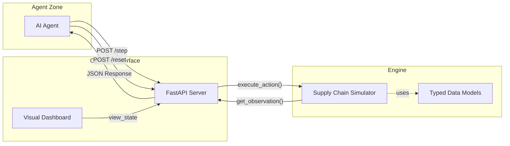

# 📦 Supply Chain Inventory Management — OpenEnv

> **An OpenEnv-compatible reinforce learning environment** where an AI agent manages warehouse inventory and shipping decisions to minimize stockouts, delays, and storage costs.

---

## 🏆 Project Highlights
-   ✅ **15/15 Compliance Checks Passed**: Fully OpenEnv compatible.
-   🎮 **3 Difficulty Tiers**: From single-product to supply chain disruptions and demand spikes.
-   🧩 **Structured Evaluation**: Baseline inference with GPT/Llama models and task-specific graders.
-   ✨ **Premium Dashboard**: Sleek dark-mode visual interface for manual interaction.
-   🐳 **Deploy Ready**: Pre-configured for Hugging Face Spaces (Docker SDK).

---

## 📐 Architecture


---

## 🏗 Project Structure
```
supply-chain-openenv/
├── openenv.yaml          # OpenEnv spec (endpoints, spaces, tasks)
├── requirements.txt      # Multi-stage dependencies
├── Dockerfile            # HF Spaces / Docker configuration
├── inference.py          # LLM baseline agent (with Mandatory Logging)
├── validate.py           # Automated 15-check pre-submission validator
├── src/
│   ├── models.py         # SupplyAction, SupplyObservation, SupplyState
│   └── client.py         # Typed HTTP Client
├── server/
│   ├── environment.py    # Core simulation engine (Logic & Rewards)
│   └── app.py            # FastAPI Server (Endpoints & Dashboard)
└── tasks/
    ├── easy_task.py      # Tier 1 Grader: Baseline stabilization
    ├── medium_task.py    # Tier 2 Grader: Multi-product prioritization
    └── hard_task.py      # Tier 3 Grader: Disruptions & Spikes
```

---

## 🎮 Environment Design

### Action Space (Discrete, n=4)
| ID | Action | Description |
|----|--------|-------------|
| **0** | `wait` | Do nothing this step |
| **1** | `order_inventory` | Place replenishment order from supplier |
| **2** | `ship_products` | Fulfil demand from current stock |
| **3** | `emergency_restock` | Immediate restock (premium cost) |

### Observation Space (Box, `[0, 1]`)
| Field | Description |
|-------|-------------|
| `current_stock` | Fraction of capacity currently occupied |
| `demand_forecast` | Normalized expected demand |
| `warehouse_capacity` | Fraction of capacity still free |
| `supplier_delay` | Lead-time as fraction of max lead-time |
| `storage_cost` | Storage cost per unit |
| `product_stocks` | Per-product distribution |
| `disruption_level` | 1.0 if supplier disruption active |

### Reward Logic
| Signal | Condition |
|--------|-----------|
| **+1.0** | Demand satisfied (stock >= demand) |
| **+0.5** | Efficient storage (20%–70% capacity) |
| **-1.0** | Stockout (stock < demand) |
| **-0.5** | Excessive overstock (>85% capacity) |

---

## 📋 Evaluation Tasks

| Task | Products | Complexity | Challenge |
|------|----------|------------|-----------|
| **Easy** | 1 | Low | Basic inventory balancing |
| **Medium** | 3 | Moderate | Multi-product demand variance |
| **Hard** | 5 | High | Supply disruptions & 4x Demand spikes |

Each task has an automated grader (`tasks/*.py`) returning a score in **[0.0, 1.0]**.

---

## 🚀 Quick Start

### 1. Installation
```bash
pip install -r requirements.txt
```

### 2. Run the Environment Server
```bash
uvicorn server.app:app --host 0.0.0.0 --port 7860
```
Open **[http://localhost:7860](http://localhost:7860)** to see the dashboard.

### 3. Run Validation check
```bash
python validate.py --auto-server
```

---

## 🤖 LLM Inference Config
Your `inference.py` script is fully compliant with the hackathon's performance and logging standards. To run an evaluation:

**Configuration (.env):**
```ini
API_BASE_URL=https://api-inference.huggingface.co/v1
MODEL_NAME=meta-llama/Meta-Llama-3-8B-Instruct
HF_TOKEN=your_hf_token
```

**Run Agent:**
```bash
python inference.py --task hard --seed 42
```

The script will emit structured stdout logs (`[START]`, `[STEP]`, `[END]`) for automated scoring.

---

## 🐳 Deployment (HF Spaces)
1.  Initialize a new Space with the **Docker SDK**.
2.  Upload `Dockerfile`, `openenv.yaml`, `requirements.txt`, and the `src/`, `server/`, `tasks/` folders.
3.  Set `HF_TOKEN`, `API_BASE_URL`, and `MODEL_NAME` in the Space's **Secrets** settings.

---

## 📄 License
MIT License
